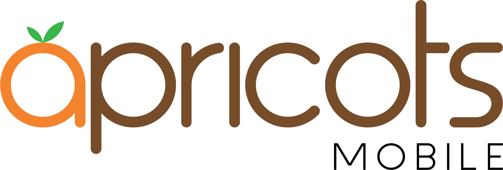

# apricots-concept

This is just a mobile company website concept design.

## Demo Site: https://apricots-concept.netlify.app/

## Development

- Clone the repo

```
gh repo clone TheBoringDude/apricots-concept
```

- Install the packages

```
cd apricots-concept && yarn install
```

- Create the development CSS file (Use `yarn prod` for production)

```
yarn build
```

- Run local (Install `live-server` > `npm i -g live-server`)

```
live-server
```

### Designed with:

- TailwindCSS

### Credits:

- [**Addie Productions**](https://web.facebook.com/addieprod/) - for the logo and permission to create a concept site from it

#### Made By:

TheBoringDude
